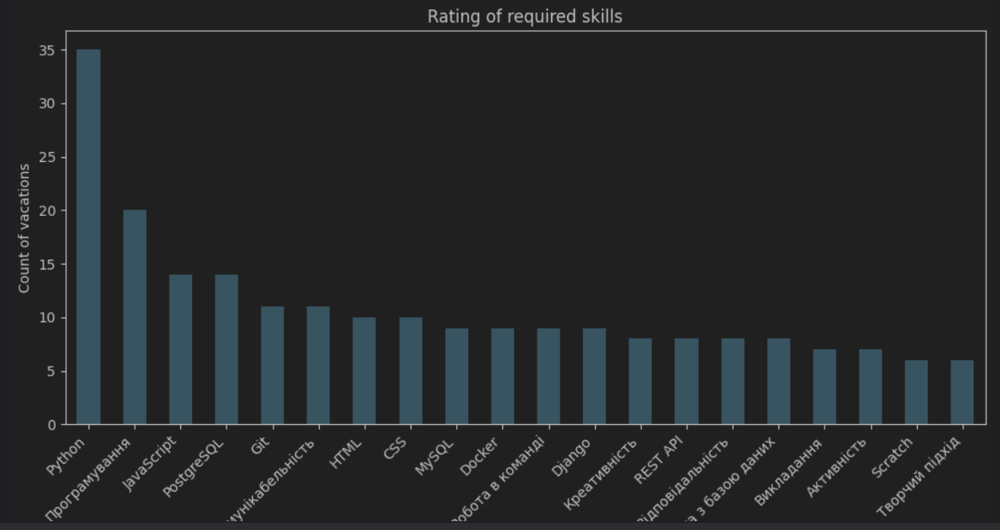

# Scraping and data analysis

The project collects data from various job search websites and analyzes the obtained information using the ELT cycle. The parser gathers data from DOU and categorizes the collected data by work experience.

## Features:
- Collects data for Python developer vacancies from the work_ua website.
- Saves data in a CSV file(you can change it in crap->config).
- Each item consists of the following fields: 
  - title
  - company
  - location
  - skills
  - additional_info
  - experience_required

- Title contain name of vacation
- company it's name of company
- location contain place where you must work
- skills its list of required skills for give an offer
- additional info contains info about full-time or part-time job and can the company take a student
- experience required - its how much years you must work in same vacation before you go to this job
- Analyzes data with a user-friendly interface in Jupyter, as well as data processing libraries like Pandas and NumPy.


## Start the Project

1. Clone repository  
```shell
git clone https://github.com/Ivan-Shakhman/Scraping-and-Analys.git
cd Scraping-and-Analys
```
2. Then, create and activate .venv environment  
```shell
python -m venv env

venv\Scripts\activate
```

3. Install requirements.txt by the command below  


```shell
pip install -r requirements.txt
```


4. Start parsing and collect data to csv by the command below
```shell
scrapy crawl job_spider
```

6. Analyse data in data_analys.ipynb (just push every green triangle for all parts of the code)


## Graphics



